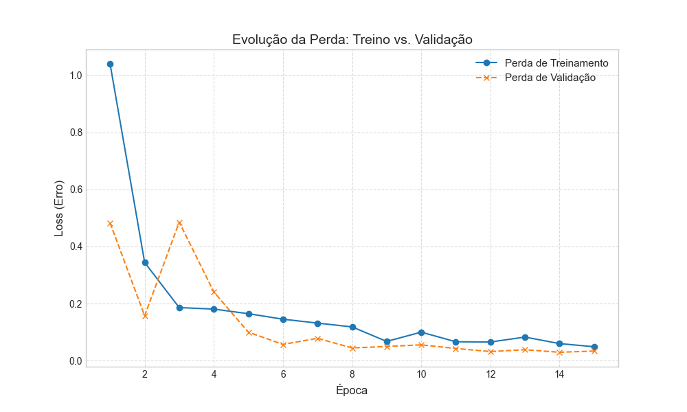
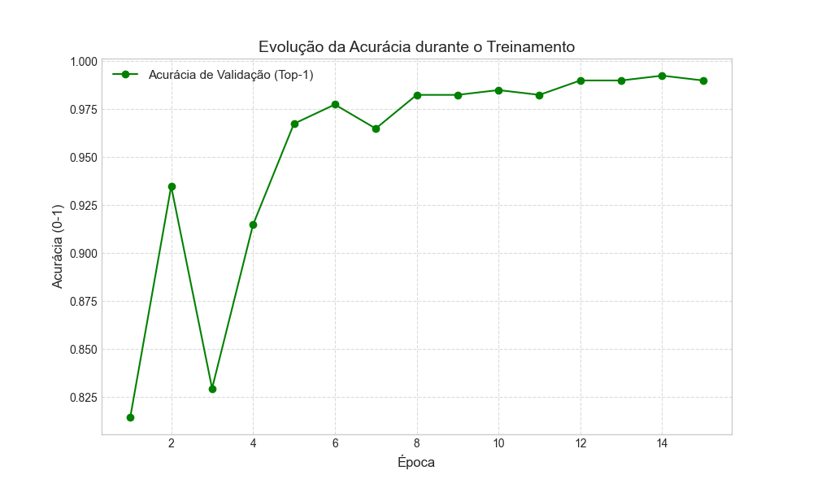

### Classificação de Níveis de Torra de Café via Visão Computacional (YOLOv8)

Este projeto implementa um modelo de aprendizado profundo para a classificação automatizada dos níveis de torra de café. O sistema visa padronizar a identificação visual dos grãos, reduzindo a subjetividade humana e garantindo o controle de qualidade no processo de torrefação.

## Objetivo
O foco é distinguir três estágios principais de torra (clara, média e escura) a partir de imagens digitais, utilizando a arquitetura YOLOv8 para garantir rapidez e precisão na classificação.

##Base de Dados
Os dados utilizados para o treinamento e validação foram obtidos através do Kaggle: [Coffee Bean Dataset](https://www.kaggle.com/datasets/gpiosenka/coffee-bean-dataset-resized-224-x-224). O conjunto contém imagens de grãos de café já redimensionadas e rotuladas de acordo com o nível de torra.

## Metodologia e Técnicas
A solução foi construída utilizando ferramentas de última geração em visão computacional:

Arquitetura: Utilização do modelo YOLOv8n-cls (versão nano), escolhida pela alta eficiência de processamento e baixo custo computacional.

Treinamento: O modelo foi configurado para 15 épocas de treinamento com imagens redimensionadas para 224x224 pixels.

Avaliação: O desempenho foi validado em um conjunto de teste independente, extraindo métricas de Acurácia Top-1 e tempo de inferência por imagem.

## Resultados

O modelo demonstra alta capacidade de identificar os padrões cromáticos correspondentes a cada nível de torra.

Os resultados confirmam a viabilidade do uso de redes neurais convolucionais para a automação da classificação sensorial visual no setor cafeeiro, apresentando métricas sólidas de acurácia, tendo atingido uma acurácia de 99.25%.

## Aplicações e Melhorias

Este sistema possui aplicações diretas em diferentes frentes da indústria:

- Monitoramento em tempo real de linhas de produção automatizadas.

- Padronização do controle de qualidade em torrefações de diferentes portes.

- Ferramenta de suporte para mestres de torra na calibração de perfis de torrefação.

Como evoluções futuras, o projeto prevê a expansão do banco de dados com diferentes variedades de grãos e a implementação do modelo em dispositivos móveis ou sistemas embarcados para uso em campo.
